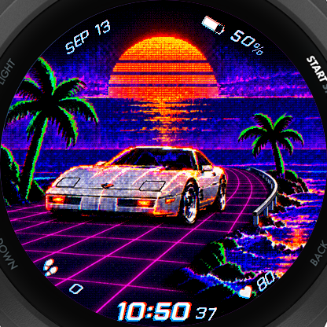

# Neon Drive Garmin Watch Face



Neon Drive is a synthwave-inspired custom watch face for the Garmin Forerunner
265. It combines a neon road scene with custom CRT-style bitmap typography and
live Garmin data.

## Features

- Local time with seconds while the display is awake
- Automatic 12/24-hour formatting
- Month and day
- Battery percentage
- Daily step count
- Most recent wrist-heart-rate sample
- Low-power always-on display designed for AMOLED screens
- Reproducible generators for the background, glyph atlases, and HUD icons

Heart rate may display `--` briefly after installation or restart while Garmin
records the first valid history sample.

## Compatibility

The current manifest, 416x416 artwork, layout coordinates, and power behavior
target the **Garmin Forerunner 265**. Supporting another device requires adding
its product ID and adapting the resources and layout for its display.

## Requirements

- [Visual Studio Code](https://code.visualstudio.com/)
- Garmin's **Monkey C** VS Code extension
- Garmin Connect IQ SDK and the Forerunner 265 device definition, installed
  through **Monkey C: Open SDK Manager**
- A Java version supported by the installed Connect IQ SDK (Java 17 is known to
  work with this project)
- A personal Connect IQ developer key

See Garmin's [Connect IQ SDK guide](https://developer.garmin.com/connect-iq/sdk/)
for the official toolchain setup.

## Set up the project

1. Clone the repository and open it in VS Code.
2. Run **Monkey C: Generate a Developer Key** from the command palette and save
   the key as `developer_key.der` in the project root.
3. Copy `.vscode/settings.example.json` to `.vscode/settings.json`.
4. If Java is not discoverable automatically, add your local
   `monkeyC.javaPath` to `.vscode/settings.json`.
5. Open either `.mc` file under `source/`.

The signing key and local VS Code settings are ignored by Git. Never commit or
share your private developer key.

## Run in the simulator

Press `Ctrl+F5`, or select **Run > Run Without Debugging**, and choose
**Forerunner 265** when prompted.

Use the simulator's **Simulation > Activity Monitoring** controls to test steps
and heart-rate values. Test both awake and low-power modes.

## Install on a watch

1. Run **Monkey C: Build for Device** and select **Forerunner 265**.
2. Connect the watch with a USB data cable.
3. Copy the emitted `.prg` file into `GARMIN/APPS` on the watch.
4. Safely eject and disconnect the watch.
5. Select **Neon Drive** from the watch-face picker.

## Project structure

```text
manifest.xml                         App metadata and Forerunner 265 target
monkey.jungle                        Connect IQ build entry point
source/NeonDriveApp.mc               Application entry point
source/NeonDriveView.mc              Rendering and live-data logic
resources/drawables/background.png   Optimized 416x416 runtime background
resources/drawables/*-hud.png        Runtime statistic icons
resources/drawables/glyphs-*.png     Runtime custom glyph atlases
art/reference-watch-face.png         Original design reference
art/synthwave-background-source.png  High-resolution background source
art/approved/*.png                   Approved typography and icon sheets
art/generate-*.ps1                   Reproducible raster-asset generators
```

The committed files under `resources/` are required by the Connect IQ compiler.
The watch face loads them through generated `Rez.Drawables` identifiers.

## Regenerate visual assets

The runtime assets are committed, so regeneration is not required to build the
watch face. The current generators use Windows PowerShell, `System.Drawing`, and
the Windows **Bahnschrift Light Condensed** font for fallback month lettering.

```powershell
powershell -NoProfile -ExecutionPolicy Bypass -File .\art\generate-background.ps1
powershell -NoProfile -ExecutionPolicy Bypass -File .\art\generate-hud-font.ps1
powershell -NoProfile -ExecutionPolicy Bypass -File .\art\generate-hud-icons.ps1
```

## Create a derivative

Before distributing a fork as a separate Connect IQ application, replace the
application ID in `manifest.xml` with a new 32-character hexadecimal UUID. In
PowerShell, one can be generated with:

```powershell
[guid]::NewGuid().ToString('N')
```

Also update the application name, version, and supported products as needed.

## License

The code and project artwork are available under the [MIT License](LICENSE).
Garmin, Forerunner, and Connect IQ are trademarks of Garmin Ltd. or its
subsidiaries. This is an independent community project and is not endorsed by
Garmin.
